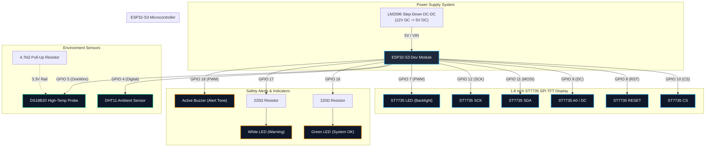

# ESP32-S3 Environment Monitoring Station

Production-grade C++17 PlatformIO firmware for an ESP32-S3 Environment Monitoring Station featuring dual temperature sensing (DS18B20 & DHT11), Open-Meteo REST API weather integration, NTP time synchronization, a flicker-free 1.8" ST7735 TFT display dashboard, non-blocking hardware indicators (LEDs & PWM buzzer), and an embedded live Web Server dashboard.

---

## Technical Specifications

- **Microcontroller**: ESP32-S3 Dev Module
- **Framework**: Arduino / ESP-IDF SDK
- **Development Environment**: PlatformIO
- **Language Standard**: Modern C++17
- **Architecture**: Layered, non-blocking `millis()` execution model (zero `delay()`)
- **Display Driver**: Adafruit ST7735 + Adafruit GFX (`GFXcanvas16` double-buffering)
- **Primary Sensors**: OneWire DS18B20 probe (High Accuracy) + DHT11 (Ambient Temperature & Humidity)
- **Cloud Integration**: Open-Meteo REST API (HTTP Client + ArduinoJson)
- **Time Synchronization**: NTP (pool.ntp.org) with timezone offset support
- **Web Dashboard**: Embedded HTTP Web Server on Port 80 with REST JSON API (`/api/data`)

---

## Visual Circuit & Wiring Diagram



---

## Complete Block Schematic

```
               +-------------------------------------------------------------+
               |                    LM2596 STEP-DOWN DC-DC                   |
               |                     12V DC  ===>  5V DC                     |
               +------------------------------+------------------------------+
                                              | 5V / VIN
                                              v
+---------------------------------------------------------------------------------------------------+
|                                     ESP32-S3 DEV MODULE                                           |
|                                                                                                   |
|  [GPIO 10] -- (SPI CS)    -----> ST7735 TFT [CS]                                                  |
|  [GPIO 8]  -- (SPI RESET)  -----> ST7735 TFT [RESET]                                               |
|  [GPIO 9]  -- (Data/Cmd)   -----> ST7735 TFT [A0 / DC]                                              |
|  [GPIO 11] -- (SPI MOSI)   -----> ST7735 TFT [SDA]                                                  |
|  [GPIO 12] -- (SPI SCK)    -----> ST7735 TFT [SCK]                                                  |
|  [GPIO 7]  -- (Backlight)  -----> ST7735 TFT [LED]                                                  |
|                                                                                                   |
|  [GPIO 4]  -- (Digital)    -----> DHT11 Sensor [DATA]                                             |
|                                                                                                   |
|  [GPIO 5]  -- (OneWire)    -----> DS18B20 Probe [DATA] <---+                                       |
|                                                              | (4.7kΩ Pull-Up)                    |
|                                                            [3.3V]                                 |
|                                                                                                   |
|  [GPIO 16] -- (Status LED) -----> [220Ω] -----> (Anode) GREEN LED (Cathode) -----> [GND]           |
|  [GPIO 17] -- (Alert LED)  -----> [220Ω] -----> (Anode) WHITE LED (Cathode) -----> [GND]           |
|  [GPIO 18] -- (PWM Tone)   -----> (+) ACTIVE BUZZER (-) -----------------------> [GND]           |
|                                                                                                   |
|  [3.3V]    -------------------------------------------------------------------> Common VCC Rail   |
|  [GND]     -------------------------------------------------------------------> Common GND Rail   |
+---------------------------------------------------------------------------------------------------+
```

---

## Hardware Pin Reference Table

| Component | Module Pin | ESP32-S3 GPIO | Notes |
| :--- | :--- | :--- | :--- |
| **ST7735 TFT** | VCC | 3.3V | Power Rail |
| | GND | GND | Common Ground |
| | CS | GPIO 10 | SPI Chip Select |
| | RESET | GPIO 8 | TFT Hardware Reset |
| | A0 / DC | GPIO 9 | Data / Command Select |
| | SDA (MOSI) | GPIO 11 | SPI MOSI |
| | SCK | GPIO 12 | SPI Serial Clock |
| | LED | GPIO 7 | PWM Backlight Brightness Control |
| **DHT11** | VCC | 3.3V | Power Rail |
| | GND | GND | Common Ground |
| | DATA | GPIO 4 | Digital Sensor Input |
| **DS18B20** | VCC | 3.3V | Power Rail |
| | GND | GND | Common Ground |
| | DATA | GPIO 5 | Requires 4.7kΩ pull-up resistor to 3.3V |
| **Green LED** | Anode | GPIO 16 | System / WiFi Status (220Ω resistor) |
| | Cathode | GND | Common Ground |
| **White LED** | Anode | GPIO 17 | Display / Sensor Error (220Ω resistor) |
| | Cathode | GND | Common Ground |
| **Active Buzzer** | + | GPIO 18 | PWM Audio Tone Generation |
| | – | GND | Common Ground |
| **LM2596** | OUT+ | 5V / VIN | 12V DC -> 5V DC Step-Down Converter |
| | OUT− | GND | Common Ground |

---

## Wokwi Simulation Diagram & Breadboard Design

The project includes an interactive breadboard simulation defined in `diagram.json`:

- **Interactive Breadboard**: `wokwi-breadboard` layout with ESP32-S3 snapped into terminal rails.
- **Display Module**: `wokwi-ili9341` / `board-st7735` SPI connection.
- **Sensor Array**: `wokwi-dht11` / `wokwi-dht22` ambient sensor and `wokwi-ds18b20` OneWire temperature probe with pull-up resistor network.
- **Indicators & Alerts**: Dual LED status indicators (`wokwi-led` green & white) with current-limiting resistors and an active PWM audio buzzer (`wokwi-buzzer`).

### How to Run Simulation
1. Install the **Wokwi Simulator** extension in VS Code.
2. Open `diagram.json` in VS Code.
3. Press `F5` or click **Start Simulation** in the Wokwi panel.

---

## System Architecture & Software Layers

The firmware uses a strict layered software architecture:

1. **Application Layer (`AppController`)**: Main system orchestrator initializing drivers, managers, and delegating execution tasks in the non-blocking `loop()`.
2. **Managers Layer**:
   - `DisplayManager`: Double-buffered ST7735 TFT rendering with precision 2-column grid layout.
   - `SensorManager`: Non-blocking sensor polling (DHT11 & DS18B20) with telemetry caching.
   - `NetworkManager`: Asynchronous WiFi reconnect state machine.
   - `TimeManager`: Non-blocking NTP clock synchronization.
   - `WeatherManager`: Open-Meteo REST API JSON parser.
   - `AlarmManager`: Multi-condition safety threshold evaluator for LEDs and Buzzer alerts.
   - `WebServerManager`: Embedded HTTP Web Server serving a live dashboard and JSON API.
3. **Drivers Layer**: Modular drivers (`DS18B20Sensor`, `DHTSensor`, `LedDriver`, `BuzzerDriver`).
4. **Utilities & Configuration**: Level-based serial `Logger`, `NonBlockingTimer`, global constants in `Config.hpp`, and pin mapping in `PinDefinitions.hpp`.

---

## Embedded Web Server & REST API

Connecting to the ESP32-S3 IP address in any browser (`http://<ESP32_IP>/`) opens a live Web Dashboard displaying real-time metrics.

### Endpoints
- `GET /` - Serves the single-page HTML/CSS/JS dashboard.
- `GET /api/data` - Returns real-time JSON metrics:

```json
{
  "time": "21:36:34",
  "date": "Sat, 25 Jul 2026",
  "wifi": true,
  "ip": "10.255.218.246",
  "ds_temp": 29.4,
  "dht_temp": 29.3,
  "dht_hum": 55.0,
  "ds_valid": true,
  "dht_valid": true,
  "outdoor_temp": 28.1,
  "feels_like": 32.0,
  "pressure": 1006.0,
  "wind_speed": 12.5,
  "weather_valid": true
}
```

---

## Installation & Build Instructions

### Prerequisites
- PlatformIO Core or PlatformIO Extension for VS Code.
- Git.

### Clone & Build
```bash
git clone https://github.com/Lalitkishore2/ESP32-S3-Environment-Station.git
cd ESP32-S3-Environment-Station

# Build firmware
pio run

# Flash to ESP32-S3
pio run -t upload

# Monitor Serial Output
pio device monitor -b 115200
```

---

## Configuration

Edit `include/config/Config.hpp` to update WiFi credentials and location settings:

```cpp
// WiFi Settings
constexpr const char* DEFAULT_WIFI_SSID = "Your_WiFi_SSID";
constexpr const char* DEFAULT_WIFI_PASS = "Your_WiFi_Password";

// Open-Meteo Location Coordinates
constexpr const char* WEATHER_LATITUDE  = "13.0246";
constexpr const char* WEATHER_LONGITUDE = "80.1873";

// Timezone Offset (Seconds from UTC)
constexpr int32_t GMT_OFFSET_SEC = 19800; // IST (+5:30)
```

---

## License

This project is licensed under the MIT License.
